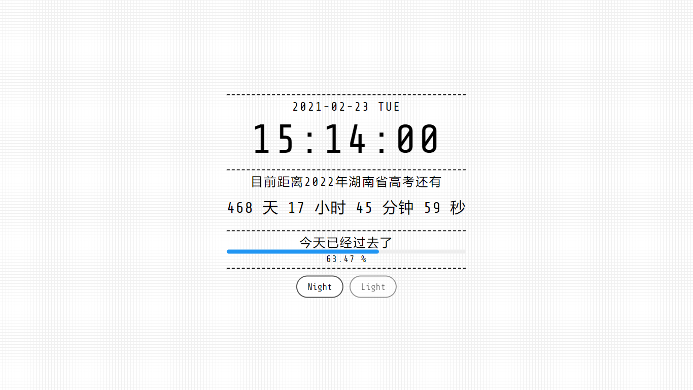

从羊咩那里魔改的联合省选倒计时！

# Digital-Clock-Countdown

用vue实现 Digital Clock + 2021 联合省选倒计时， [Demo](https://tony102.xyz/Clock/index.html)

已部署至tony102.xyz

## 实现参考

进度条采用: [vue-simple-progress](https://github.com/dzwillia/vue-simple-progress)

Digital Clock 和大体的 CSS  是从 [Digital Clock with Vue.js - Toshiyuki TAKAHASH](https://codepen.io/gau/pen/LjQwGp) 处剽窃过来的

倒计时的实现参考了 [MicDZ的文章](https://www.micdz.cn/article/time/)

## 演示案例

